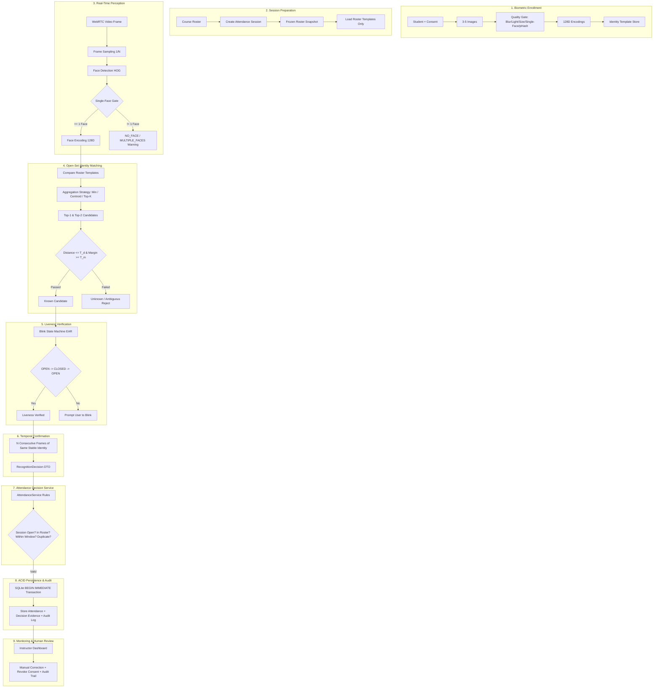

# 🎓 Face Attendance Verification Platform — Privacy-Aware Open-Set Face Recognition with Liveness & Human Review

> **A human-in-the-loop classroom attendance platform combining biometric enrollment quality control, roster-constrained open-set face matching, distance-and-margin rejection, blink liveness, temporal confirmation, transactional attendance rules and privacy-aware biometric lifecycle management.**  
> *Được xây dựng với Python 3.11+, Streamlit, WebRTC, OpenCV, dlib/face_recognition, FastAPI và SQLite (WAL Mode).*


-003B57?logo=sqlite)


---

## 🏛️ 1. Canonical 9-Stage Verification Pipeline

Hệ thống được thiết kế và vận hành theo **Canonical 9-Stage Pipeline** thống nhất xuyên suốt từ Perception, Decision Service đến Persistence và Human Audit:



### Chi Tiết 9 Giai Đoạn:
1. **Biometric Enrollment**: Thu thập 3-5 ảnh kèm sự đồng ý minh bạch (explicit consent). Đi qua Quality Gate kiểm tra kích thước ($\ge 100\text{px}$), độ mờ (Laplacian variance $\ge 45$), ánh sáng, kiểm tra duy nhất 1 mặt, và phát hiện ảnh gần trùng lặp bằng Perceptual Hash (pHash). Trích xuất và lưu vector 128D (không lưu ảnh gốc).
2. **Session Preparation**: Khi mở buổi học, hệ thống đóng băng danh sách sinh viên vào `session_enrollments` (Frozen Roster Snapshot). Runtime chỉ nạp vector của sinh viên trong môn học, giúp thu hẹp không gian tìm kiếm, giảm rủi ro nhận nhầm và bảo vệ dữ liệu sinh trắc học.
3. **Real-Time Face Perception**: Khung hình WebRTC được lấy mẫu (sampling 1/3 frame, thu nhỏ $0.25\times$). Áp dụng **Single-Face Policy Gate**: Chỉ tiếp tục xử lý khi khung hình có duy nhất 1 khuôn mặt; nếu phát hiện $\ge 2$ khuôn mặt (`MULTIPLE_FACES`), lập tức dừng pipeline và cảnh báo.
4. **Open-Set Identity Matching**: So khớp vector đầu vào với danh sách mẫu lớp học theo công thức:
   $$d_1 \le T_d \quad \text{và} \quad d_2 - d_1 \ge T_m$$
   Hỗ trợ 3 chiến lược gom cụm mẫu: Min Distance (mặc định), Centroid, và Top-2 Mean.
5. **Liveness Verification (Interactive Blink Heuristic)**: Máy trạng thái FSM tỉ lệ mắt Eye Aspect Ratio (EAR): $\text{OPEN} \to \text{CLOSED} \to \text{OPEN} \to \text{VERIFIED}$ với TTL. Ngăn chặn hình thức gian lận bằng ảnh tĩnh in giấy hoặc tablet.
6. **Temporal Confirmation & Stability**: Đếm chuỗi xác thực liên tiếp ($N=3$ frames) của **cùng một danh tính ổn định** (`identity_track_state`). Nếu nhận diện bị nhảy giữa các mã sinh viên khác nhau, bộ đếm lập tức được làm mới. Kết quả đóng gói thành `RecognitionDecision` DTO.
7. **Attendance Decision Service**: Tách biệt hoàn toàn thị giác máy tính khỏi cơ sở dữ liệu. Tầng nghiệp vụ kiểm tra tính hợp lệ: buổi học đang mở, đúng khung giờ, chưa điểm danh trước đó, sinh viên có trong danh sách snapshot.
8. **ACID Persistence & Decision Evidence**: Giao dịch SQLite với khóa `BEGIN IMMEDIATE` chống tương tranh (race condition). Lưu trữ đầy đủ bằng chứng quyết định: `recognition_distance`, `identity_margin`, `margin_threshold`, `liveness_policy`, `recognition_policy_version`, `confirmation_frames`.
9. **Monitoring & Human Review**: Giảng viên có quyền kiểm tra, xác nhận và sửa điểm danh thủ công (First-Class Manual Correction). Mọi can thiệp lưu vết audit trail đầy đủ (`original_status`, `final_status`, `corrected_by`, `correction_reason`, `corrected_at_utc`).

---

## 📌 2. Phạm Vi & Ranh Giới Nghiệp Vụ (Scope & Boundaries)

- **Quy mô mục tiêu**: Phù hợp cho **lớp học quy mô nhỏ đến vừa** (khoảng 30 đến 100 sinh viên/buổi).
- **Chính sách Single-Face**: Nhận diện **một sinh viên tại một thời điểm**. Khi nhiều người cùng xuất hiện trước camera, hệ thống cảnh báo và từ chối ghi nhận.
- **Quyền quyết định tối cao (Human-in-the-Loop)**: Quyết định AI chỉ mang tính đề xuất. Giảng viên luôn là người quyết định cuối cùng và có công cụ điều chỉnh trực tiếp trên giao diện.
- **Giới hạn an ninh**: Kiểm tra chớp mắt là tương tác kiểm tra cơ bản (interactive heuristic), không phải mô hình Deep Learning Presentation Attack Detection (PAD) chống video replay tinh vi.

---

## 📊 3. Báo Cáo Đánh Giá & Hiệu Chuẩn AI (Evaluation & Calibration Benchmark)

### ⚠️ Ghi Chú Minh Bạch Về Dữ Liệu Benchmark
Báo cáo dưới đây được sinh ra từ script `tools/evaluate_matching.py` chạy ở chế độ **Synthetic Matcher Sanity Benchmark** (sử dụng các vector 128D chuẩn hóa L2 mô phỏng để kiểm định tính đúng đắn của logic thuật toán matcher, margin sweep và độ trễ). Báo cáo kiểm thử phần mềm, không đại diện cho độ chính xác sinh trắc học trên camera thực tế khi chưa nạp bộ ảnh thật vào `data/private/`.

### 3.1 Phân Phối Khoảng Cách L2 (Genuine vs Impostor)
```text
  Khoảng cách L2      Genuine (Sinh viên đúng)     Impostor (Người lạ)
  ──────────────────────────────────────────────────────────────────────────
  [0.20 - 0.30]  |  █████            ( 71)  |                   (  0) 
  [0.30 - 0.40]  |  ████████████████ (200)  |                   (  0) 
  [0.40 - 0.50]  |  █                ( 17)  |                   (  0) 
  [0.50 - 0.60]  |                   (  0)  |                   (  0)  ◄ [NGƯỠNG T_d=0.50]
  [0.60 - 0.80]  |                   (  0)  |                   (  0) 
  [0.80 - 1.00]  |                   (  0)  |                   (  0) 
  [1.00 - 1.20]  |                   (  0)  |                   (  2) 
  [1.20 - 1.40]  |                   (  0)  |  ▒▒▒▒▒▒▒▒▒▒▒▒     (631) 
  [1.40 - 1.60]  |                   (  0)  |  ▒▒▒▒▒▒▒▒▒▒▒▒▒▒▒▒ (807) 
  ──────────────────────────────────────────────────────────────────────────
```

### 3.2 Lưới Hiệu Chuẩn Khoảng Cách & Margin (Threshold x Margin Grid)
*Tách bạch rõ ràng giữa Known Reject (bị từ chối) và Wrong-ID (nhận nhầm sang SV khác):*

| Khoảng cách ($T_d$) | Margin ($T_m$) | TAR (Đúng SV) | Known Reject (Bị từ chối) | Wrong-ID (Nhận nhầm SV) | Unknown FAR | Đạt chuẩn an toàn? |
|:---:|:---:|:---:|:---:|:---:|:---:|:---:|
| 0.40 | 0.05 | 100.0% | 0.0% | 0.0% | 0.0% | ✅ AN TOÀN |
| 0.45 | 0.05 | 100.0% | 0.0% | 0.0% | 0.0% | ✅ AN TOÀN |
| **0.50 (Mặc định)** | **0.05** | **100.0%** | **0.0%** | **0.0%** | **0.0%** | **✅ TỐI ƯU KHUYẾN NGHỊ** |
| 0.55 | 0.08 | 100.0% | 0.0% | 0.0% | 0.0% | ✅ AN TOÀN |

### 3.3 So Sánh 3 Chiến Lược Gom Cụm Danh Tính (Aggregation Strategies)
Khi sinh viên đăng ký nhiều vector mẫu (3-5 ảnh):

| Chiến lược gom cụm | Nguyên lý tính khoảng cách | TAR | Wrong-ID | Unknown FAR | Độ trễ/khung hình |
|---|---|:---:|:---:|:---:|:---:|
| **Strategy A: Min Distance** | $\min_j \|e - e_{ij}\|$ (kèm bộ lọc pHash) | 100.0% | 0.0% | 0.0% | 0.34 ms |
| **Strategy B: Centroid** | $\|e - \text{norm}(\frac{1}{N}\sum e_{ij})\|$ | 100.0% | 0.0% | 0.0% | 0.67 ms |
| **Strategy C: Top-2 Mean** | Trung bình khoảng cách 2 mẫu gần nhất | 100.0% | 0.0% | 0.0% | 0.46 ms |

### 3.4 Recognition Policy Artifact (`recognition_policy.json`)
Cấu hình nhận diện được đóng băng thành file artifact có thể kiểm toán:
```json
{
  "schema_version": 1,
  "embedding_model": "dlib_face_recognition_resnet_v1",
  "embedding_dim": 128,
  "distance_metric": "euclidean_l2",
  "distance_threshold": 0.50,
  "identity_margin": 0.05,
  "aggregation_strategy": "min_distance",
  "confirmation_frames": 3,
  "liveness_policy": "ear-blink-v1",
  "benchmark_type": "synthetic_sanity_benchmark"
}
```

---

## 🏗️ 4. Cấu Trúc Mã Nguồn & Clean Architecture

Kiến trúc thư mục thực tế của dự án tuân thủ nghiêm ngặt mô hình phân tầng:

```text
face-attendance-system/
├── src/face_attendance/
│   ├── domain/               # Core business rules, enums, entities, exceptions
│   │   ├── entities.py       # RecognitionDecision, AttendanceResult DTOs
│   │   ├── enums.py          # AttendanceStatus, RejectionReason, MatchQuality
│   │   └── exceptions.py     # AttendanceError, DuplicateAttendanceError, etc.
│   ├── application/          # Application Services (Điều phối nghiệp vụ)
│   │   ├── attendance_service.py # record_biometric_attendance, record_manual_attendance
│   │   └── enrollment_service.py # process_student_enrollment
│   ├── matcher.py            # Open-Set Matcher (Min distance, Centroid, Top-K aggregation)
│   ├── liveness.py           # EAR Blink State Machine heuristic
│   ├── recognition.py        # Single-Face Gate, Quality Gate, pHash, WebRTC Engine
│   ├── database.py           # SQLite WAL, BEGIN IMMEDIATE, Audit Trail, Migrations
│   ├── api.py                # RESTful API (FastAPI) với /biometric & /manual routes
│   ├── ui.py                 # Streamlit WebRTC Dashboard & Human Review Interface
│   ├── config.py             # Cấu hình biến môi trường & validation
│   └── utils.py              # Xử lý thời gian UTC/VN, chuẩn hóa chuỗi, PIN PBKDF2
├── data/
│   ├── private/              # Bộ dữ liệu đánh giá độc lập (được .gitignore bảo vệ)
│   │   ├── enrollment/       # 3-5 ảnh/người
│   │   ├── validation/       # Dùng dò threshold (known & unknown)
│   │   └── test/             # Dùng đánh giá khóa policy một lần (known & unknown)
│   └── results/              # evaluation_report.md & recognition_policy.json
├── tools/
│   ├── evaluate_matching.py  # Công cụ hiệu chuẩn threshold, margin & aggregation
│   └── prepare_dataset.py    # Kiểm tra rò rỉ hash SHA-256 & pHash near-duplicate
├── tests/                    # Bộ kiểm thử tự động 29+ test cases
├── Dockerfile                # Container deployment
└── pyproject.toml            # Package metadata & dependencies
```

---

## 🔐 5. Quản Lý Vòng Đời Sinh Trắc Học (Privacy-Aware Biometric Controls)

Hệ thống triển khai các cơ chế bảo vệ quyền riêng tư sinh trắc học thực tiễn:
1. **Không lưu ảnh gốc theo mặc định**: Sau khi Quality Gate giải mã và trích xuất vector 128 chiều thành công, mảng byte ảnh gốc được giải phóng khỏi bộ nhớ, chỉ lưu vector đặc trưng.
2. **Yêu cầu đồng ý minh bạch (Explicit Consent)**: Sinh viên bắt buộc phải đánh dấu xác nhận đồng ý xử lý dữ liệu khuôn mặt trước khi đăng ký mẫu vào hệ thống.
3. **Quyền rút lại đồng ý (Revoke Consent)**: Giảng viên/quản trị viên có thể thu hồi dữ liệu của sinh viên (`remove_student_biometrics`), xóa sạch toàn bộ vector khuôn mặt khỏi cơ sở dữ liệu trong khi vẫn bảo lưu lịch sử điểm danh và nhật ký kiểm toán.
4. **Tự động dọn dẹp dữ liệu hết hạn (Biometric Retention)**: Hàm `purge_expired_biometrics()` tự động vô hiệu hóa các vector khuôn mặt vượt quá thời hạn lưu trữ cấu hình (`BIOMETRIC_RETENTION_DAYS`).
5. **Kiểm soát ảnh gần trùng (Near-Duplicate Control)**: Tích hợp pHash (Perceptual Hash) phát hiện các ảnh chụp cùng một góc hoặc khung hình giống nhau để yêu cầu đa dạng hóa góc nhìn.
6. **Timing Attack Protection**: Xác thực `X-API-Key` và mã PIN bằng `secrets.compare_digest` và PBKDF2-HMAC-SHA256 (240,000 vòng lặp).

---

## 🧪 6. Kiểm Thử Tự Động (Automated Testing Suite)

Bộ test bao phủ đầy đủ các tầng từ domain, matcher, validation ảnh, concurrency đến API:

```powershell
python -m pytest tests/ -p no:cacheprovider --basetemp=./scratch/pytest_tmp -v
```

Các ca kiểm thử trọng yếu:
- **Test Single-Face Gate & Matcher**: Kiểm tra 0 mặt, đúng 1 mặt, và $>1$ mặt; kiểm tra vector 127D/129D, chứa NaN/Inf, khoảng cách ranh giới $T_d$ và $T_m$.
- **Test Aggregation Strategies**: Kiểm tra tính đúng đắn của Min Distance, Centroid và Top-K Mean.
- **Test Concurrency & ACID Lock**: 50 luồng chạy song song ghi điểm danh đồng thời kiểm tra cơ chế khóa `BEGIN IMMEDIATE` của SQLite.
- **Test API Security & Manual Audit**: Kiểm tra xác thực `X-API-Key`, ngăn chặn rò rỉ stack trace, kiểm tra luồng sửa điểm danh thủ công có lưu audit log.

---

## 🚀 7. Cài Đặt & Khởi Chạy (Quick Start)

### 7.1 Cài đặt môi trường
```powershell
git clone <repository-url>
cd face-attendance-system
python -m venv .venv
.venv\Scripts\Activate.ps1
pip install -e ".[dev]"
```

### 7.2 Khởi tạo cấu trúc & Chạy Benchmark
```powershell
python tools/prepare_dataset.py
python tools/evaluate_matching.py
```

### 7.3 Chạy Web Dashboard (Streamlit)
```powershell
streamlit run app.py
```
Truy cập: `http://localhost:8501`

### 7.4 Chạy REST API (FastAPI)
```powershell
uvicorn face_attendance.api:app --reload --port 8000
```
Swagger UI tài liệu API: `http://127.0.0.1:8000/docs`

---

## 💼 8. Điểm Sáng Đưa Vào CV / Phỏng Vấn (Engineering Highlights)

1. **Canonical 9-Stage Verification Pipeline**: Thiết kế pipeline chuẩn chỉnh 9 giai đoạn bao gồm Enrollment QC, Frozen Roster Snapshot, Single-Face Gate, Open-Set Top-1/Top-2 Margin, Blink FSM, Temporal Confirmation, Decision Service, ACID Persistence và Human Review.
2. **Clean Architecture Decoupling**: Tách rời hoàn toàn Computer Vision perception khỏi Persistence layer. `RecognitionEngine` chỉ sản sinh `RecognitionDecision` DTO, giao phó việc kiểm tra nghiệp vụ và giao dịch cho `AttendanceService`.
3. **Transparent Evaluation & Policy Artifact**: Xây dựng công cụ hiệu chuẩn tham số 2 chiều (Distance $\times$ Margin Grid Sweep), phân tách rạch ròi giữa *Known Reject* và *Wrong Identity*, và đóng băng cấu hình thành file `recognition_policy.json`.
4. **ACID Transaction & Concurrency Control**: Xử lý 50+ request đồng thời không xung đột bằng SQLite `BEGIN IMMEDIATE` lock và snapshot danh sách môn học bất biến theo từng buổi.
5. **Privacy-Aware Biometric Lifecycle**: Kiểm soát vòng đời sinh trắc học với kiểm tra ảnh gần trùng pHash, bắt buộc consent, tự động dọn dẹp vector hết hạn, và bảo lưu audit trail cho mọi can thiệp thủ công của con người.

---

## 📄 9. Giấy Phép (License)
Dự án được phân phối dưới giấy phép **MIT License**.

